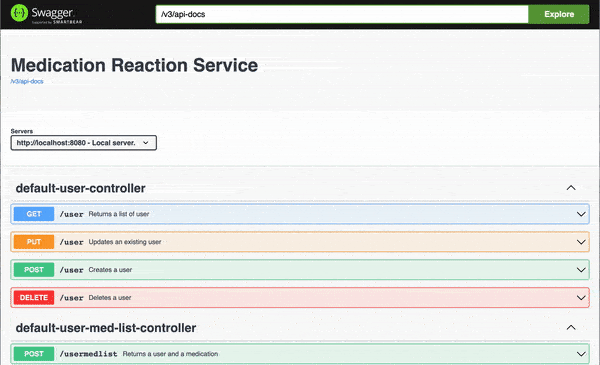
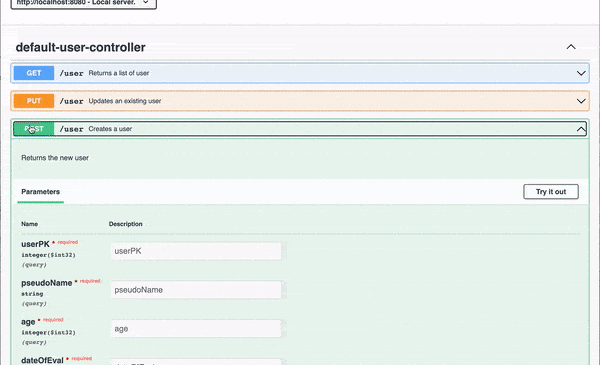
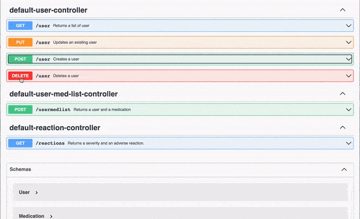

<div id="top"></div>

## Check It Out
Deployed on [soon!]!





## About The Project
Promineo Tech Back-End Development Spring Boot Final Project.

The database was conceptualized as a tool for use by medical speech-language pathologists (SLP) when evaluating a new patient for dysphagia (swallow impairment). Many medications have known possible adverse reaction on swallow function and the SLP needs to be aware if the patient is prescribed them. 

In conjunction with the [CRUD-Med-App] (https://github.com/thisLinda/CRUD-Med-App) previously built for the front-end course the user will be able to 1) enter a medication brand or generic name to ascertain if the medication has adverse reactions, 2) if true the severity and reaction are displayed, 3) the user can build a list of medications for patients with full CRUD functionality.

Currently this database offers CRUD operations for User, create a User and medication, and get a severity/reaction pair.

<p align="right">(<a href="#top">back to top</a>)</p>

## Technologies
[IntelliJ IDEA](https://www.jetbrains.com/idea/)<br>
[Swagger](https://swagger.io/)<br>
[MySQL](https://www.mysql.com/)<br>
[MySQLWorkbench](https://www.mysql.com/products/workbench//)<br>
[DBeaverCommunity](https://dbeaver.io/)<br>
[diagrams.net](https://app.diagrams.net/)<br>

<p align="right">(<a href="#top">back to top</a>)</p>

## Setup
Clone the repo
   ```sh
   git clone https://github.com/thisLinda/dysphagia-med-reactions-db
   ```

Run the project in IntelliJ or import to Eclipse (built with Maven)

Use the [Swagger-UI](https://swagger.io/tools/swagger-ui/) to visualize and interact with the API
at [localhost:8080/swagger-ui/index.html](localhost:8080/swagger-ui/index.html)<br>

<p align="right">(<a href="#top">back to top</a>)</p>

## Connect With Me!

[Twitter URL]: https://img.shields.io/badge/Twitter-1DA1F2?style=for-the-badge&logo=twitter&logoColor=white
[![Twitter][Twitter URL]](https://twitter.com/L_Forlizzi)

[linkedin-shield]: https://img.shields.io/badge/-LinkedIn-black.svg?style=for-the-badge&logo=linkedin&colorB=555
[![LinkedIn][linkedin-shield]](https://linkedin.com/in/linda-forlizzi)

<p align="right">(<a href="#top">back to top</a>)</p>

## Learn More
About [Nashua Community College](https://www.nashuacc.edu/workforce-development/coding-boot-camp) and [Promineo Tech](https://www.promineotech.com/).

<p align="right">(<a href="#top">back to top</a>)</p>
